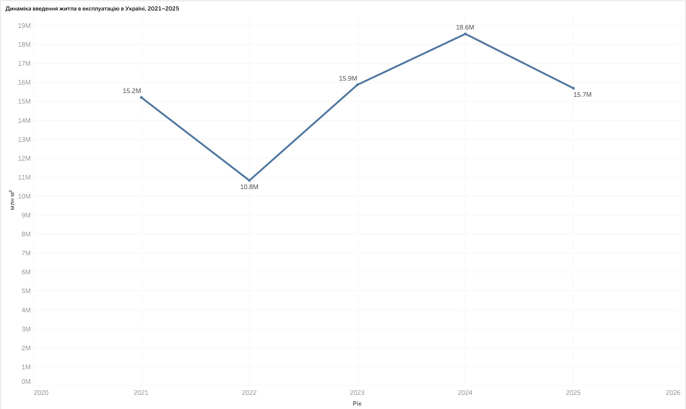
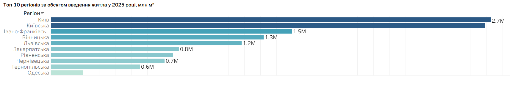
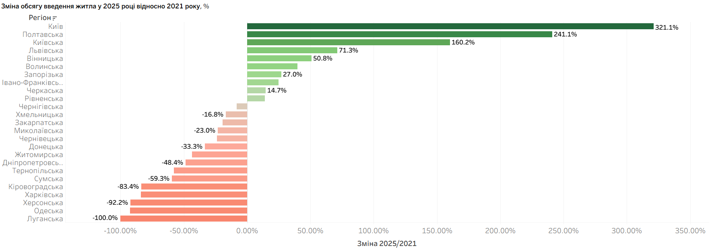
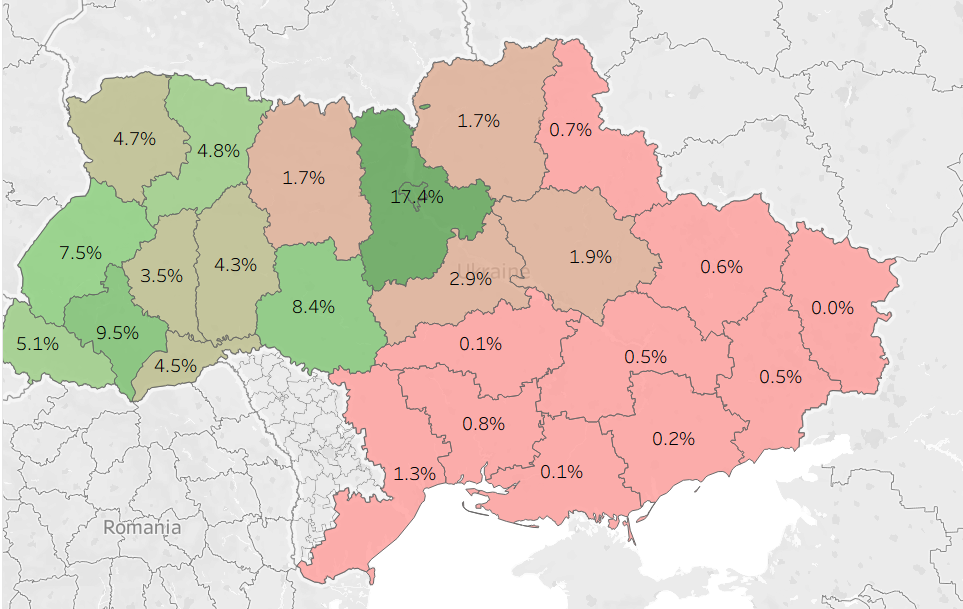
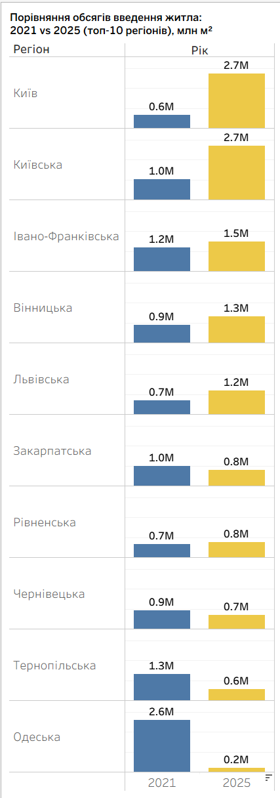

# Регіональні диспропорції у введенні житла в Україні (2021–2025)

Проведено аналіз обсягів введення житла в експлуатацію за регіонами України у 2021–2025 роках. Мета — оцінити масштаби падіння і відновлення після 2022 року та визначити області, які потребують пріоритетної державної підтримки.

## Мета і завдання

**Мета:** проаналізувати регіональні диспропорції у введенні житла в експлуатацію у 2021–2025 роках та визначити пріоритетні області для державної підтримки будівництва.

**Завдання:**
- оцінити загальну динаміку введення житла по Україні;
- визначити регіони-лідери та регіони-аутсайдери;
- порівняти обсяги 2025 року з довоєнним 2021 роком;
- сформувати рекомендації для держави, бізнесу та громадян.

## Дані та методологія

Джерело даних — Державна служба статистики України, [stat.gov.ua](https://stat.gov.ua/).

- Показник: загальна площа квартир у житлових будинках, прийнятих в експлуатацію, м².
- Тип будівлі: житлові будинки без житлових будинків для колективного проживання.
- Тип місцевості: загалом.
- Період: 2021–2025.
- Одиниця аналізу: області України та м. Київ.

АР Крим і м. Севастополь виключено через відсутність даних з 2014 року. Луганську, Донецьку, Херсонську та Запорізьку області залишено в розрахунках: низькі або нульові значення відображають реальну ситуацію на прифронтових і частково окупованих територіях, а не помилку обліку.

Етапи підготовки даних:
1. очищення сирого файлу Держстату;
2. агрегація квартальних значень до річного рівня;
3. розрахунок зміни 2025/2021 та частки регіону у 2025 році;
4. переведення таблиці в довгий формат для Tableau.

## Інтерактивна візуалізація

[Дашборд у Tableau Public](https://public.tableau.com/app/profile/victoriia.artemieva/viz/20212025_17874731918840/20212025?publish=yes)

## Візуалізації

### Динаміка по Україні

### Топ-10 регіонів у 2025 році

### Зміна 2025 відносно 2021

### Карта часток регіонів

### Порівняння 2021 і 2025

